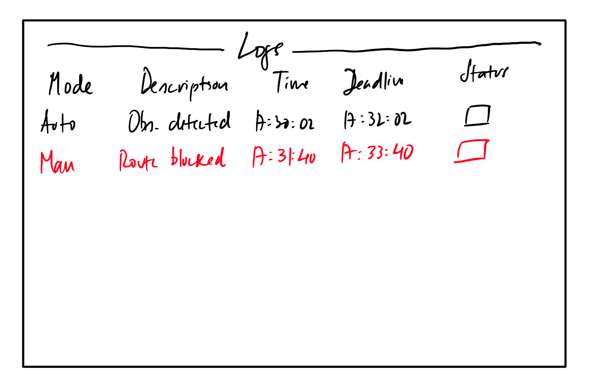

# Logs

The **Logs** tab registers the vehicle actions (if the vehicle is automatic mode), or the operator actions (if the vehicle is in manual mode).

The fields that this tab shows are as follows:

- `Mode` - Operating mode
- `Description` - Description of the occurrence
- `Time` - Time of the occurence
- `Deadline` - Time that the operator has to acknoledge the occurence
- `Status` - Where the operator can acknoledge the occurrence by clicking on the checkbox.

!!! note
    If a occurence happens in manual mode, the log will be recorded in red color.
