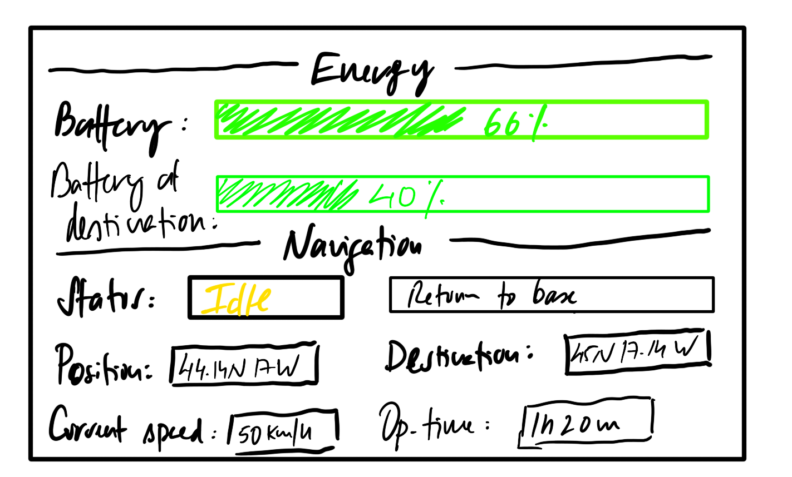

# Navigation

## Energy tab

The energy tab shows the values that follows:

- `Battery`: current battery level
- `Battery at destination`: estimated battery level at destination.

!!! note
    The **battery** value can take up to 5 seconds to refresh.

## Navigation tab

The navigation tab shows the values that follows:

- `Status`: **idle**, **charging**, or ***en route***
- `Action`: last action registered by the vehicle
- `Position`: coordinates of the vehicle position
- `Destination`: coordinates of the vehicle destination
- `Current speed`: vehicle speed
- `Operation time`: time since the vehicle was charged.