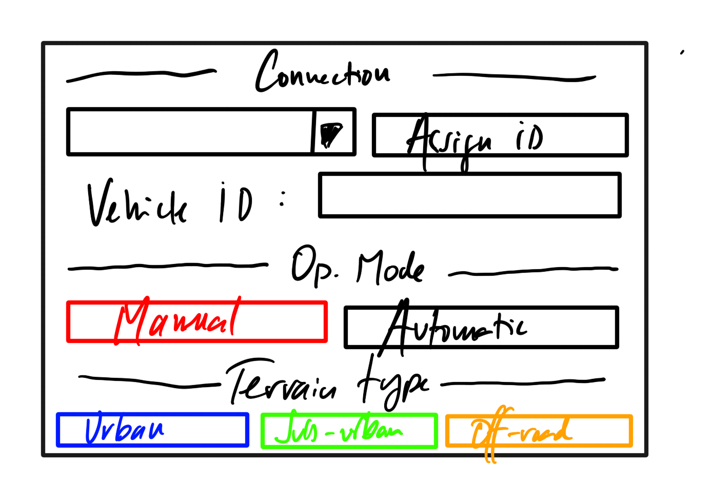

# To initialize a vehicle

## To prepare the vehicle
1. Power on the vehicle and your computer.
2. Make sure that the vehicle and your computer are connected to the same network.

    !!! note
        When the vehicle is successfully connected, the dropdown will turn green.
        For vehicle-to-software connection issues, see the network diagnosis section in [maintenance](../Maintenance/tips.md). 

3. Do a check of all critical systems:

| System | Test description |
|--------|------------------|
| Brakes | Make sure that vehicle can stop in a safe manner |
| Cameras and sensors | Make sure that all sensors are funcional. Calibrate them if necessary. |
| Seatbelts and airbags | Make sure that all safety equipment is functional |
| Child safety locks | Make sure that the child safety locks are functional |
| Emergency communication | Make sure that the vehicle notificates the system if emergency mode is activated |
| Software updates | Make sure that software updates are encrypted and validated. |

!!! warning
    Vehicle movement can be restricted if one of the above systems is not working as intended.

## To assign a **Fleet ID** to a vehicle

1. In the **connection** tab, Press the arrow of the dropdown, and select the vehicle you want to connect to.
2. The vehicle will request its **Fleet ID** from the server, based on VIN number and MAC address. If the vehicle is registered, its **Fleet ID** will show in **vehicle ID** field.
3. If the vehicle is not registered, press the **Assign** button to assign a **Fleet ID** to the vehicle.
4. Make sure that over-the-air software updates are encrypted and authenticated.

## To select the operating mode

!!! warning
    It is not recommended to use the **Manual** operating mode unless the vehicle is stopped and in a safe location. With great power comes great responsability.

1. Press the **Manual** or the **Automatic** buttons to select the operating mode.

    !!! note
        If you select the **Manual** operating mode, every operator action will be [logged](./logs.md) as part of the safety protocol. 
    
2. Use the arrows in the [camera](../Initialization/camera.md) view to control the vehicle. 

## To calibrate the vehicle according to terrain type

1. Make sure that the vehicle is powered and stopped.
2. Press **Urban**, **Suburban**, or **Off-road** buttons to select the terrain type.

    !!! note
        The vehicle can take up to 15 seconds to complete the calibration.

    !!! note

        For example, an SUV configured for **off-road** might have higher suspension and
        different route optimization.

3. Calibrate the vehicle sensors. See the [maintenance](../Maintenance/tips.md) section. 
